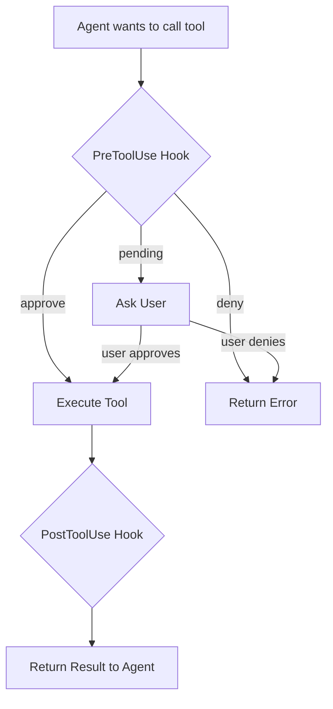

# Hooks Overview

This document provides a conceptual overview of the Agentrix hooks system.

## What are Hooks?

Hooks are **interception points** in the agent lifecycle where you can inject custom behavior. Think of them as event listeners that trigger at specific moments during agent execution.

### Analogy

Hooks work like middleware in web frameworks:

```
User Request → [PreToolUse Hook] → Tool Execution → [PostToolUse Hook] → Response
```

Just as Express middleware can inspect and modify HTTP requests/responses, hooks can inspect and modify tool calls and their results.

## Why Use Hooks?

### 1. **Security & Access Control**

```typescript
// Block dangerous operations
export async function PreToolUse(input: PreToolUseHookInput) {
  if (input.tool_name === 'Bash' &&
      input.tool_input?.command?.includes('rm -rf /')) {
    return { decision: 'deny', message: 'Operation denied' };
  }
  return { decision: 'approve' };
}
```

### 2. **Audit & Compliance**

```typescript
// Log all file operations
export async function PostToolUse(input: PostToolUseHookInput) {
  if (input.tool_name === 'Write' || input.tool_name === 'Edit') {
    await logToAuditSystem({
      action: input.tool_name,
      file: input.tool_input?.file_path,
      timestamp: Date.now()
    });
  }
  return {};
}
```

### 3. **Environment Setup**

```typescript
// Initialize repository with custom files
export async function RepositoryInit(input: RepositoryInitHookInput) {
  const { workspace_path } = input;

  // Add custom .gitignore
  appendFileSync(
    join(workspace_path, '.gitignore'),
    '\n.env\nnode_modules/\n'
  );

  // Create README
  writeFileSync(
    join(workspace_path, 'README.md'),
    '# Project created by Agentrix\n'
  );

  return {};
}
```

### 4. **Integration with External Systems**

```typescript
// Notify Slack when session starts
export async function SessionStart(input: SessionStartHookInput) {
  await fetch('https://hooks.slack.com/...', {
    method: 'POST',
    body: JSON.stringify({
      text: `Agent session started: ${input.session_id}`
    })
  });
  return {};
}
```

## Hook Architecture

### Three-Layer System

Agentrix implements a three-layer hook execution system:

```
┌─────────────────────────────────────────┐
│  System Hooks (Built-in)                │
│  - Git state management                 │
│  - Workspace initialization             │
│  - Error handling                       │
└──────────────┬──────────────────────────┘
               │ delegates to
               ↓
┌─────────────────────────────────────────┐
│  Global Hooks (User-defined)            │
│  - User-wide preferences                │
│  - Cross-agent policies                 │
└──────────────┬──────────────────────────┘
               │ delegates to
               ↓
┌─────────────────────────────────────────┐
│  Agent Hooks (Agent-specific)           │
│  - Custom behavior per agent            │
│  - Domain-specific logic                │
└─────────────────────────────────────────┘
```

**Execution Order**:
1. System hooks execute first (mandatory)
2. If system hooks pass, global hooks execute
3. If global hooks pass, agent hooks execute

Each layer can:
- **approve**: Continue to next layer
- **deny**: Block and return error
- **pending**: Request user confirmation

### Hook Execution Flow



## Hook Categories

### 1. Tool Lifecycle Hooks

Control tool execution:

- **PreToolUse**: Before tool executes
  - Can approve, deny, or request confirmation
  - Can modify tool inputs
  - Use for: Access control, validation, logging

- **PostToolUse**: After tool executes
  - Can inspect results
  - Can modify outputs (future feature)
  - Use for: Audit logging, metric collection, result processing

### 2. Session Lifecycle Hooks

Track agent sessions:

- **SessionStart**: Agent session begins
  - Initialize resources
  - Set up logging
  - Connect to external services

- **SessionEnd**: Agent session ends
  - Clean up resources
  - Save final state
  - Send notifications

- **UserPromptSubmit**: User sends a message
  - Log user inputs
  - Pre-process prompts
  - Enforce content policies

- **Stop**: Agent is stopping
  - Save work-in-progress
  - Commit changes
  - Update status

- **SubagentStop**: Subagent completes
  - Collect subagent results
  - Update parent agent state

### 3. Context Management Hooks

Handle memory limits:

- **PreCompact**: Before context compaction
  - Save important context
  - Add custom summary instructions
  - Log compaction events

### 4. System Event Hooks

Respond to system events:

- **Notification**: System notifications
  - Forward to external systems
  - Log important events
  - Trigger alerts

### 5. Repository Lifecycle Hooks (Agentrix Custom)

Manage git repositories:

- **RepositoryInit**: New repository created
  - Add custom .gitignore rules
  - Create initial files
  - Set up project structure
  - **NOTE**: Only triggers in `git init` mode, NOT `git clone`

## Hook Signature

All hooks follow a consistent signature:

```typescript
export async function HookName(
  input: HookInput,           // Hook-specific input data
  toolUseID: string,          // Unique ID for this invocation
  options: {
    signal: AbortSignal       // For timeout/cancellation
  }
): Promise<HookResult>        // Hook-specific return type
```

### Parameters

1. **input**: Hook-specific data (e.g., tool name, session ID)
2. **toolUseID**: Unique identifier for this hook invocation
3. **options.signal**: AbortSignal for timeout handling (30s limit)

### Return Values

#### PreToolUse

```typescript
return {
  decision: 'approve' | 'deny' | 'pending',
  message?: string,           // Shown to user if denied
  toolInput?: any             // Modified tool input (future)
};
```

#### Other Hooks

```typescript
return {};  // Most hooks just need empty object
```

## Type Safety

Hook types are provided by two packages:

**Claude SDK hooks** (from `@anthropic-ai/claude-agent-sdk`):

```typescript
import type {
  // Claude SDK hook types
  PreToolUseHookInput,
  PostToolUseHookInput,
  SessionStartHookInput,
  SessionEndHookInput,
  UserPromptSubmitHookInput,
  StopHookInput,
  SubagentStartHookInput,
  SubagentStopHookInput,
  PreCompactHookInput,
  NotificationHookInput,
  PermissionRequestHookInput,
} from '@anthropic-ai/claude-agent-sdk';
```

**Agentrix custom hooks** (from `@agentrix/shared`):

```typescript
import type {
  // Agentrix custom hook types
  RepositoryInitHookInput,
  // Hook factory type (for context access)
  HookFactory,
  AgentrixContext,
} from '@agentrix/shared';
```

This provides:
- TypeScript IntelliSense
- Compile-time type checking
- IDE autocomplete
- Breaking change detection

## Accessing AgentrixContext

Hooks can access `AgentrixContext` to get workspace information, task/user IDs, and make RPC calls. Use the **factory pattern**:

```typescript
import type { HookFactory, AgentrixContext } from '@agentrix/shared';

const createHooks: HookFactory = (context: AgentrixContext) => ({
  PreToolUse: async (input) => {
    const workspace = context.getWorkspace();
    const taskId = context.getTaskId();
    const userId = context.getUserId();

    console.log(`[PreToolUse] Task ${taskId} in ${workspace}`);
    return { decision: 'approve' as const };
  },
});

export default createHooks;
```

**AgentrixContext methods**:
- `getWorkspace()`: Absolute path to workspace directory
- `getTaskId()`: Current task ID
- `getUserId()`: Current user ID
- `createAgentBuilder(params)`: Create agent builder via RPC

See [Development Guide - Using AgentrixContext](3.development-guide.md#using-agentrixcontext-in-hooks) for complete documentation.

## Hook Lifecycle

### 1. Development

```bash
# Create hooks project
mkdir -p claude/hooks/src
cd claude/hooks
npm init -y
npm install @agentrix/shared @anthropic-ai/claude-agent-sdk
```

### 2. Implementation

```typescript
// src/index.ts
import type { PreToolUseHookInput } from '@anthropic-ai/claude-agent-sdk';

export async function PreToolUse(
  input: PreToolUseHookInput,
  toolUseID: string,
  options: { signal: AbortSignal }
) {
  return { decision: 'approve' };
}
```

### 3. Build

```bash
npm run build  # Outputs to dist/index.mjs
```

### 4. Execution

When agent runs:
1. Agentrix loads hooks from `dist/index.mjs`
2. Validates hook signatures
3. Wraps hooks with timeout/error handling
4. Executes hooks at appropriate lifecycle points

## Performance Considerations

### Timeout

All hooks have a **30-second timeout**. If a hook takes longer:

```
⚠ [Hook] PreToolUse exceeded timeout (30s), skipping
```

**Best practices**:
- Keep hooks fast (< 1s typically)
- Use async I/O for external calls
- Don't block on user input
- Cache expensive computations

### Error Handling

Hook errors are non-fatal by default:

```typescript
export async function PreToolUse(input: PreToolUseHookInput) {
  try {
    // Your logic
    return { decision: 'approve' };
  } catch (error) {
    console.error('Hook failed:', error);
    // Fallback: approve by default
    return { decision: 'approve' };
  }
}
```

If a hook crashes, the agent continues with a warning.

### Resource Management

Hooks run in the same process as the agent worker:

```typescript
// ✅ Good: Fast, in-memory check
export async function PreToolUse(input: PreToolUseHookInput) {
  const blacklist = ['rm -rf', 'dd if='];
  const cmd = input.tool_input?.command || '';

  if (blacklist.some(b => cmd.includes(b))) {
    return { decision: 'deny' };
  }

  return { decision: 'approve' };
}

// ❌ Bad: Slow, external API call on every tool use
export async function PreToolUse(input: PreToolUseHookInput) {
  const response = await fetch('https://api.example.com/check', {
    method: 'POST',
    body: JSON.stringify(input)
  });
  // This adds latency to every tool call!
}
```

## Debugging Hooks

### Console Logging

```typescript
export async function PreToolUse(input: PreToolUseHookInput) {
  console.log('[PreToolUse] Tool:', input.tool_name);
  console.log('[PreToolUse] Input:', input.tool_input);

  return { decision: 'approve' };
}
```

Logs appear in agent output:

```
[PreToolUse] Tool: Read
[PreToolUse] Input: { file_path: '/path/to/file.ts' }
```

### Verbose Mode

```bash
DEBUG=agentrix:hooks agentrix run --agent=./my-agent
```

### Testing Hooks

```typescript
// test/hooks.test.ts
import { PreToolUse } from '../src/index';
import type { PreToolUseHookInput } from '@anthropic-ai/claude-agent-sdk';

describe('PreToolUse', () => {
  it('approves safe commands', async () => {
    const input: PreToolUseHookInput = {
      hook_event_name: 'PreToolUse',
      session_id: 'test-session',
      transcript_path: '/tmp/transcript',
      cwd: '/tmp',
      tool_name: 'Read',
      tool_input: { file_path: 'test.txt' },
      tool_use_id: 'test-tool-use-id'
    };

    const result = await PreToolUse(input, 'test-id', {
      signal: new AbortController().signal
    });

    expect(result.decision).toBe('approve');
  });

  it('denies dangerous commands', async () => {
    const input: PreToolUseHookInput = {
      hook_event_name: 'PreToolUse',
      session_id: 'test-session',
      transcript_path: '/tmp/transcript',
      cwd: '/tmp',
      tool_name: 'Bash',
      tool_input: { command: 'rm -rf /' },
      tool_use_id: 'test-tool-use-id'
    };

    const result = await PreToolUse(input, 'test-id', {
      signal: new AbortController().signal
    });

    expect(result.decision).toBe('deny');
  });
});
```

## Common Patterns

See [Examples](8.examples.md) for copy-paste patterns:

- Security controls
- Audit logging
- External integrations
- Repository initialization
- Custom validations

## Limitations

What hooks **cannot** do:

- ❌ Modify agent's base system prompt
- ❌ Add new tools (use MCP servers)
- ❌ Access other hooks' state
- ❌ Block longer than 30 seconds
- ❌ Modify tool outputs (PostToolUse is read-only currently)

What hooks **can** do:

- ✅ Approve/deny/request confirmation for tool calls
- ✅ Log and audit all operations
- ✅ Initialize repository files
- ✅ Integrate with external systems
- ✅ Enforce custom policies

## Next Steps

- [Development Guide](3.development-guide.md) - Set up TypeScript project
- [Hook Types Reference](4.hook-types.md) - All hook signatures
- [RepositoryInit](6.repository-init.md) - Repository initialization hook
- [PreToolUse & PostToolUse](5.pre-tool-use.md) - Tool control hooks
- [Examples](8.examples.md) - Real-world patterns

## Related Documentation

- [Agent Structure](../3.agent-structure.md) - Hook directory structure
- [Configuration](../4.configuration.md) - Enabling hooks in config
- [Testing](../testing.md) - Testing hooks locally
- [API Reference](../api-reference.md) - Complete type definitions
