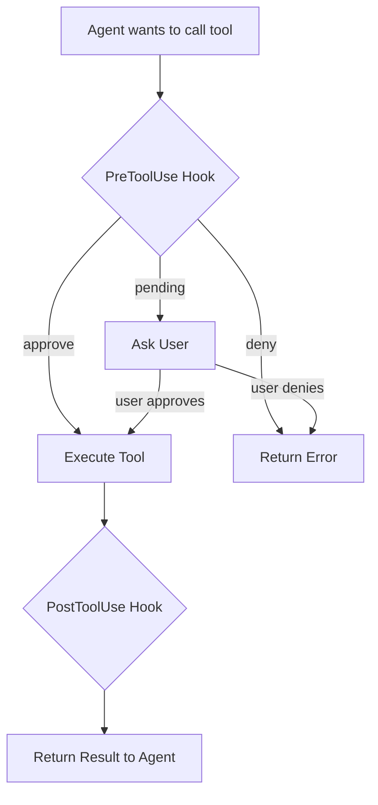

# 钩子概述

本文档提供了 Agentrix 钩子系统的一个概念性概述。

## 钩子是什么？

钩子是代理生命周期中的**拦截点** ，您可以在其中注入自定义行为。可以将它们视为在代理执行过程中特定时刻触发的监听器。

### 类比

钩子就像 Web 框架中的中间件一样工作：

```
User Request → [PreToolUse Hook] → Tool Execution → [PostToolUse Hook] → Response
```

就像 Express 中间件可以检查和修改 HTTP 请求/响应一样，钩子可以检查和修改工具调用及其结果。

## 为什么要使用钩子？

### 1\. **安全性与访问控制**

```typescript
// Block dangerous operations
export async function PreToolUse(input: PreToolUseHookInput) {
  if (input.tool_name === 'Bash' &&
      input.tool_input?.command?.includes('rm -rf /')) {
    return { decision: 'deny', message: 'Operation denied' };
  }
  return { decision: 'approve' };
}
```

### 2\. **审计与合规**

```typescript
// Log all file operations
export async function PostToolUse(input: PostToolUseHookInput) {
  if (input.tool_name === 'Write' || input.tool_name === 'Edit') {
    await logToAuditSystem({
      action: input.tool_name,
      file: input.tool_input?.file_path,
      timestamp: Date.now()
    });
  }
  return {};
}
```

### 3\. **环境设置**

```typescript
// Initialize repository with custom files
export async function RepositoryInit(input: RepositoryInitHookInput) {
  const { workspace_path } = input;

  // Add custom .gitignore
  appendFileSync(
    join(workspace_path, '.gitignore'),
    '\n.env\nnode_modules/\n'
  );

  // Create README
  writeFileSync(
    join(workspace_path, 'README.md'),
    '# Project created by Agentrix\n'
  );

  return {};
}
```

### 4\. **与外部系统集成**

```typescript
// Notify Slack when session starts
export async function SessionStart(input: SessionStartHookInput) {
  await fetch('https://hooks.slack.com/...', {
    method: 'POST',
    body: JSON.stringify({
      text: `Agent session started: ${input.session_id}`
    })
  });
  return {};
}
```

## Hook 架构

### 三层系统

Agentrix 实现了一个三层钩子执行系统：

```
┌─────────────────────────────────────────┐
│  System Hooks (Built-in)                │
│  - Git state management                 │
│  - Workspace initialization             │
│  - Error handling                       │
└──────────────┬──────────────────────────┘
               │ delegates to
               ↓
┌─────────────────────────────────────────┐
│  Global Hooks (User-defined)            │
│  - User-wide preferences                │
│  - Cross-agent policies                 │
└──────────────┬──────────────────────────┘
               │ delegates to
               ↓
┌─────────────────────────────────────────┐
│  Agent Hooks (Agent-specific)           │
│  - Custom behavior per agent            │
│  - Domain-specific logic                │
└─────────────────────────────────────────┘
```

**执行顺序** ：

1.  系统钩子首先执行（强制）
2.  如果系统钩子通过，全局钩子执行
3.  如果全局钩子通过，代理钩子执行

每一层可以：

*   **批准** ：继续到下一层
*   **拒绝** : 阻止并返回错误
*   **待定** : 请求用户确认

### 钩子执行流程



## 钩子分类

### 1\. 工具生命周期钩子

控制工具执行：

*   **PreToolUse**：工具执行前
    
    *   可以批准、拒绝或请求确认
    *   可以修改工具输入
    *   用于：访问控制、验证、日志记录
*   **PostToolUse**：工具执行后
    
    *   可以检查结果
    *   可以修改输出（未来功能）
    *   用于：审计日志记录、指标收集、结果处理

### 2\. 会话生命周期钩子

跟踪代理会话：

*   **会话开始** : 代理会话开始
    
    *   初始化资源
    *   设置日志记录
    *   连接到外部服务
*   **会话结束** : 代理会话结束
    
    *   清理资源
    *   保存最终状态
    *   发送通知
*   **UserPromptSubmit**: 用户发送消息
    
    *   记录用户输入
    *   预处理提示
    *   执行内容策略
*   **停止** : 代理正在停止
    
    *   保存进行中的工作
    *   提交更改
    *   更新状态
*   **SubagentStop**: 子代理完成
    
    *   收集子代理结果
    *   更新父代理状态

### 3\. 上下文管理钩子

处理内存限制：

*   **预压缩** ：在上下文压缩之前
    *   保存重要上下文
    *   添加自定义摘要指令
    *   日志压缩事件

### 4\. 系统事件钩子

响应系统事件：

*   **通知** ：系统通知
    *   转发至外部系统
    *   记录重要事件
    *   触发警报

### 5\. 仓库生命周期钩子（Agentrix 自定义）

管理 git 仓库：

*   **RepositoryInit**：新仓库已创建
    *   添加自定义.gitignore 规则
    *   创建初始文件
    *   设置项目结构
    *   **注意** ：仅在 `git init` 模式下触发，不适用于 `git clone`

## 钩子签名

所有钩子都遵循一致的签名：

```typescript
export async function HookName(
  input: HookInput,           // Hook-specific input data
  toolUseID: string,          // Unique ID for this invocation
  options: {
    signal: AbortSignal       // For timeout/cancellation
  }
): Promise<HookResult>        // Hook-specific return type
```

### 参数

1.  **输入** : 钩子特定数据（例如，工具名称、会话 ID）
2.  **toolUseID**: 此钩子调用的唯一标识符
3.  **options.signal**: 超时处理的 AbortSignal（限制为 30 秒）

### 返回值

#### PreToolUse

```typescript
return {
  decision: 'approve' | 'deny' | 'pending',
  message?: string,           // Shown to user if denied
  toolInput?: any             // Modified tool input (future)
};
```

#### 其他钩子

```typescript
return {};  // Most hooks just need empty object
```

## 类型安全

钩子类型由两个包提供：

**Claude SDK 钩子** (来自 `@anthropic-ai/claude-agent-sdk` ):

```typescript
import type {
  // Claude SDK hook types
  PreToolUseHookInput,
  PostToolUseHookInput,
  SessionStartHookInput,
  SessionEndHookInput,
  UserPromptSubmitHookInput,
  StopHookInput,
  SubagentStartHookInput,
  SubagentStopHookInput,
  PreCompactHookInput,
  NotificationHookInput,
  PermissionRequestHookInput,
} from '@anthropic-ai/claude-agent-sdk';
```

**Agentrix 自定义钩子** (来自 `@agentrix/shared`):

```typescript
import type {
  // Agentrix custom hook types
  RepositoryInitHookInput,
  // Hook factory type (for context access)
  HookFactory,
  AgentrixContext,
} from '@agentrix/shared';
```

这提供了：

*   TypeScript 代码补全
*   编译时类型检查
*   IDE 自动补全
*   破坏性变更检测

## 访问 AgentrixContext

钩子可以访问 `AgentrixContext` 来获取工作区信息、任务/用户 ID，并进行 RPC 调用。使用**工厂模式** ：

```typescript
import type { HookFactory, AgentrixContext } from '@agentrix/shared';

const createHooks: HookFactory = (context: AgentrixContext) => ({
  PreToolUse: async (input) => {
    const workspace = context.getWorkspace();
    const taskId = context.getTaskId();
    const userId = context.getUserId();

    console.log(`[PreToolUse] Task ${taskId} in ${workspace}`);
    return { decision: 'approve' as const };
  },
});

export default createHooks;
```

**AgentrixContext 方法** :

*   `getWorkspace()`: 工作空间目录的绝对路径
*   `getTaskId()`: 当前任务 ID
*   `getUserId()`: 当前用户 ID
*   `createAgentBuilder(params)`: 通过 RPC 创建代理构建器

参见[开发指南 - 使用 AgentrixContext](3.development-guide.md#using-agentrixcontext-in-hooks) 获取完整文档。

## 钩子生命周期

### 1\. 开发

```bash
# Create hooks project
mkdir -p claude/hooks/src
cd claude/hooks
npm init -y
npm install @agentrix/shared @anthropic-ai/claude-agent-sdk
```

### 2\. 实现

```typescript
// src/index.ts
import type { PreToolUseHookInput } from '@anthropic-ai/claude-agent-sdk';

export async function PreToolUse(
  input: PreToolUseHookInput,
  toolUseID: string,
  options: { signal: AbortSignal }
) {
  return { decision: 'approve' };
}
```

### 3\. 构建

```bash
npm run build  # Outputs to dist/index.mjs
```

### 4\. 执行

当代理运行时：

1.  Agentrix 从 `dist/index.mjs` 加载钩子
2.  验证钩子签名
3.  为钩子添加超时/错误处理
4.  在适当的生命周期点执行钩子

## 性能考量

### 超时

所有钩子都有一个 **30 秒超时** 。如果钩子执行时间更长：

```
⚠ [Hook] PreToolUse exceeded timeout (30s), skipping
```

**最佳实践** ：

*   保持钩子快速（通常小于1秒）
*   使用异步 I/O 进行外部调用
*   不要阻塞用户输入
*   缓存昂贵的计算

### 错误处理

钩子错误默认非致命：

```typescript
export async function PreToolUse(input: PreToolUseHookInput) {
  try {
    // Your logic
    return { decision: 'approve' };
  } catch (error) {
    console.error('Hook failed:', error);
    // Fallback: approve by default
    return { decision: 'approve' };
  }
}
```

如果钩子崩溃，代理会继续并发出警告。

### 资源管理

钩子与代理工作进程在同一个进程中运行：

```typescript
// ✅ Good: Fast, in-memory check
export async function PreToolUse(input: PreToolUseHookInput) {
  const blacklist = ['rm -rf', 'dd if='];
  const cmd = input.tool_input?.command || '';

  if (blacklist.some(b => cmd.includes(b))) {
    return { decision: 'deny' };
  }

  return { decision: 'approve' };
}

// ❌ Bad: Slow, external API call on every tool use
export async function PreToolUse(input: PreToolUseHookInput) {
  const response = await fetch('https://api.example.com/check', {
    method: 'POST',
    body: JSON.stringify(input)
  });
  // This adds latency to every tool call!
}
```

## 调试钩子

### 控制台日志记录

```typescript
export async function PreToolUse(input: PreToolUseHookInput) {
  console.log('[PreToolUse] Tool:', input.tool_name);
  console.log('[PreToolUse] Input:', input.tool_input);

  return { decision: 'approve' };
}
```

日志出现在代理输出中：

```
[PreToolUse] Tool: Read
[PreToolUse] Input: { file_path: '/path/to/file.ts' }
```

### 详细模式

```bash
DEBUG=agentrix:hooks agentrix run --agent=./my-agent
```

### 测试钩子

```typescript
// test/hooks.test.ts
import { PreToolUse } from '../src/index';
import type { PreToolUseHookInput } from '@anthropic-ai/claude-agent-sdk';

describe('PreToolUse', () => {
  it('approves safe commands', async () => {
    const input: PreToolUseHookInput = {
      hook_event_name: 'PreToolUse',
      session_id: 'test-session',
      transcript_path: '/tmp/transcript',
      cwd: '/tmp',
      tool_name: 'Read',
      tool_input: { file_path: 'test.txt' },
      tool_use_id: 'test-tool-use-id'
    };

    const result = await PreToolUse(input, 'test-id', {
      signal: new AbortController().signal
    });

    expect(result.decision).toBe('approve');
  });

  it('denies dangerous commands', async () => {
    const input: PreToolUseHookInput = {
      hook_event_name: 'PreToolUse',
      session_id: 'test-session',
      transcript_path: '/tmp/transcript',
      cwd: '/tmp',
      tool_name: 'Bash',
      tool_input: { command: 'rm -rf /' },
      tool_use_id: 'test-tool-use-id'
    };

    const result = await PreToolUse(input, 'test-id', {
      signal: new AbortController().signal
    });

    expect(result.decision).toBe('deny');
  });
});
```

## 常见模式

查看[示例](8.examples.md)以获取复制粘贴模式：

*   安全控制
*   审计日志记录
*   外部集成
*   仓库初始化
*   自定义验证

## 限制

**无法**做到的事情：

*   ❌ 修改代理的基础系统提示
*   ❌ 添加新工具（使用 MCP 服务器）
*   ❌ 访问其他钩子的状态
*   ❌ 堵塞超过30秒
*   ❌ 修改工具输出（PostToolUse 目前为只读）

**钩子**能做什么：

*   ✅ 批准/拒绝/请求确认工具调用
*   ✅ 记录并审计所有操作
*   ✅ 初始化仓库文件
*   ✅ 与外部系统集成
*   ✅ 执行自定义策略

## 下一步

*   [开发指南](3.development-guide.md) \- 设置 TypeScript 项目
*   [钩子类型参考](4.hook-types.md) \- 所有钩子签名
*   [RepositoryInit](6.repository-init.md) - 仓库初始化钩子
*   [PreToolUse & PostToolUse](5.pre-tool-use.md) - 工具控制钩子
*   [Examples](8.examples.md) - 真实世界模式

## 相关文档

*   [Agent Structure](../3.agent-structure.md) - 钩子目录结构
*   [Configuration](../4.configuration.md) - 在配置中启用钩子
*   [测试](../testing.md) \- 在本地测试钩子
*   [API 参考](../api-reference.md) \- 完整类型定义
